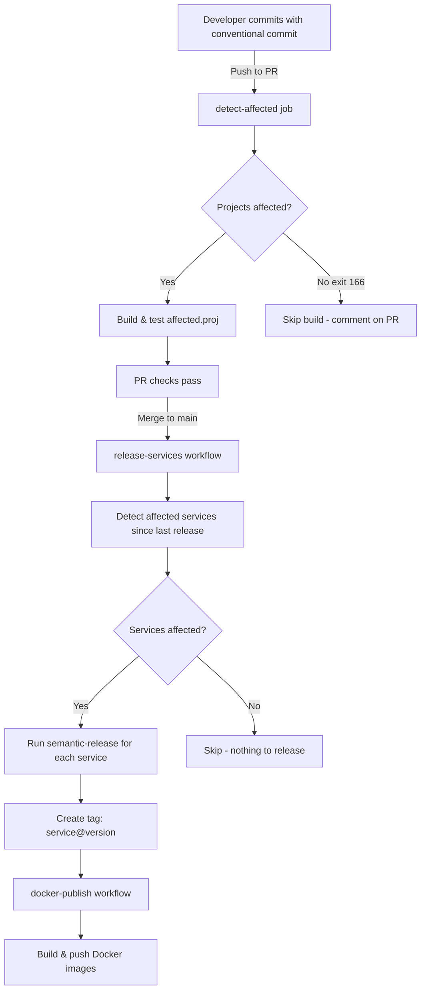

# Quick Reference: dotnet-affected + Semantic Release

## For Developers

### Making Changes

When working on a service, use conventional commits with the service scope:

```bash
# Feature
git commit -m "feat(catalog): add product filtering"

# Bug fix  
git commit -m "fix(catalog): correct price calculation"

# Breaking change
git commit -m "feat(catalog)!: change API response format"
```

### What Gets Built?

When you open a PR:
- ✅ Only affected projects are built and tested
- ✅ CI runs faster
- ✅ PR comment shows which projects are affected

### Testing Locally

```bash
# See what would be affected by your changes
dotnet affected describe

# Generate build file for affected projects
dotnet affected --format traversal

# Build only affected projects
dotnet build affected.proj

# Test only affected projects  
dotnet test affected.proj
```

## For DevOps/CI Maintainers

### Workflow Files

| Workflow | Purpose | Trigger |
|----------|---------|---------|
| `dotnet-test-check.yaml` | PR validation with affected projects | Pull requests to `main` |
| `release-services.yaml` | Semantic release for affected services | Push to release branches |
| `docker-publish.yaml` | Docker image builds | Service tags (e.g., `catalog@v1.2.3`) |

### How Releases Work

1. **Push to `main`** with conventional commits
2. **dotnet-affected** detects which services changed
3. **semantic-release** creates versions and tags for each affected service
   - Example tag: `catalog@v1.2.3`
4. **docker-publish** workflow triggers on the tag
5. **Docker images** are built and pushed to registry

### Exit Codes

- `0` - Success, affected projects found
- `166` - No projects affected (not an error, just skip builds)
- Other codes - Actual errors

### Monitoring

Check workflow run summaries:
- PR: Lists affected projects in comment
- Release: Summary shows which services were released

## Service Setup Checklist

Adding a new service? Make sure you have:

- [ ] `src/services/{service-name}/{Service}.Api/` directory structure
- [ ] `.releaserc.json` in service directory
- [ ] `Dockerfile` in the Api project
- [ ] Update commit scopes to include your service name
- [ ] Test locally with `dotnet affected --assume-changes {Service}.Api`

## Common Scenarios

### Scenario: Shared buildingblock changed

**What happens:** All services depending on it are affected
**CI behavior:** Builds and tests all dependent services
**Release:** May release multiple services if they all changed

### Scenario: Only one service changed

**What happens:** Only that service is affected
**CI behavior:** Builds and tests only that service
**Release:** Only releases that one service

### Scenario: Documentation only change

**What happens:** No projects affected (exit 166)
**CI behavior:** Skips build/test (nothing to build)
**Release:** No release created

### Scenario: `Directory.Packages.props` changed

**What happens:** All projects potentially affected
**CI behavior:** Full build/test
**Release:** May release all services

## Useful Commands

```bash
# Check affected projects from main to your branch
dotnet affected --from origin/main --to HEAD --verbose

# See what would be in affected.proj without creating it
dotnet affected --dry-run

# Exclude test/benchmark projects
dotnet affected --exclude ".*Tests.*" --exclude ".*Benchmarks.*"

# Get JSON output for scripting
dotnet affected --format json

# Assume a project changed (for testing)
dotnet affected --assume-changes SharedKernel.Core
```

## Integration Flow



## Troubleshooting

| Problem | Solution |
|---------|----------|
| Everything affected when only one file changed | Check if you changed `Directory.Build.props` or `Directory.Packages.props` |
| Nothing affected when files changed | Ensure changes are in tracked project files, not orphaned files |
| Release not triggering | Check conventional commit format and scope |
| Docker build not triggering | Ensure service has `Dockerfile` and is in `src/services/{name}/{Name}.Api/` |

## Support

- Documentation: [`docs/dotnet-affected.md`](./docs/dotnet-affected.md)
- dotnet-affected issues: https://github.com/leonardochaia/dotnet-affected/issues
- Semantic-release docs: https://semantic-release.gitbook.io/
